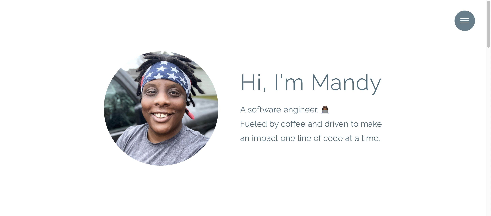

# My Portfolio 2022

<h3 align="center"> Online home to my projects, details about myself and another way to communicate with others via the contact form.</h3>

**Check it out:** https://mandybishop.netlify.app/

## How It's Made:

**Tech used:** HTML, CSS, Sass and JavaScript 

A portfolio gives you a chance to express yourself. It is your online resume. This portfolio will constantly evolve as I continue through my software engineering journey. A little piece of me!

## Lessons Learned:

- I am no designer but I enjoyed building my portfolio!
- Always check the version of your font awesome kit to ensure compatibility. 
- Be mindful for techniques, and/or frameworks, that could make my portfolio more scalable and optimized to the end user. 

